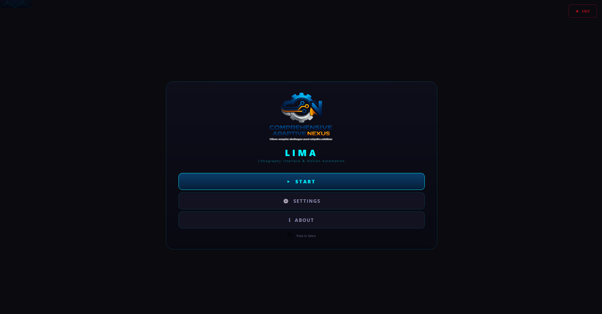
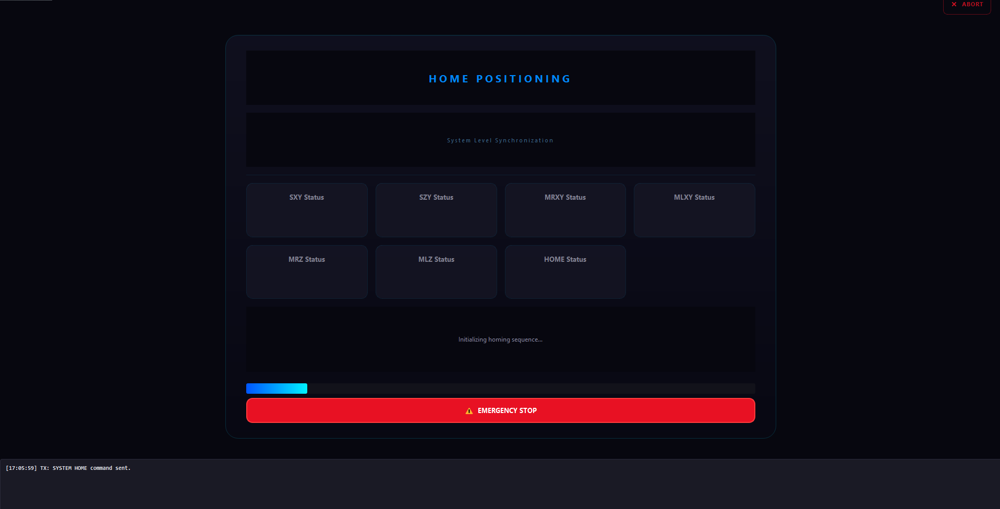
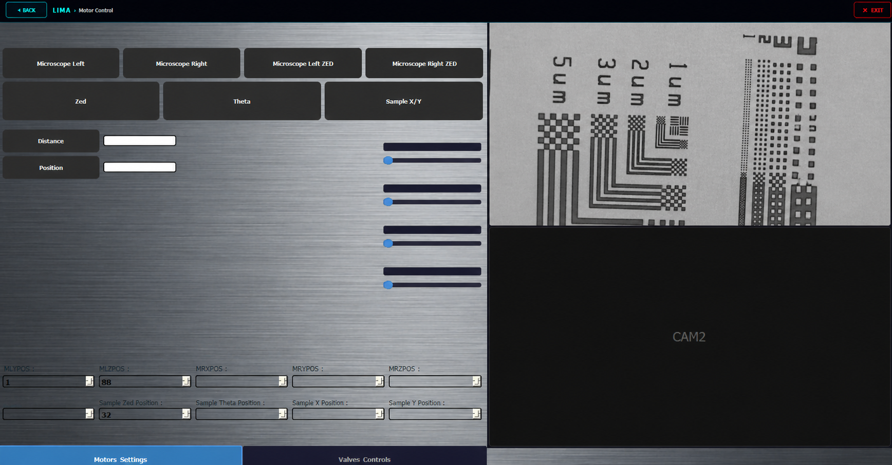

# LIMA Advanced Control System


## Overview

The **LIMA Advanced Control System** is a professional, high-precision graphical interface designed for comprehensive motor management, microscopy operations, and automated photolithography processing. It communicates securely with an STM32-based hardware architecture via a robust, custom 8-byte binary protocol. 

## Features & Modules

### 🎛️ Process & Interface Control
- **Vacuum Control Systems**: Complete independent control over sample and mask vacuums. Provides real-time visual feedback (Red/Green status indicators) for `Vacuum Contact`, `Mask Vacuum`, and `Sample Vacuum`.
- **Contact Modes**: Switch seamlessly between Hard Contact, Soft Contact, Vacuum Contact, and Proximity modes.
- **Exposure & Alignment**: Automated tracking of exposure dose, power, and energy with integrated Auto-Align and Auto-Focus sequences.
- **Live Camera Feed**: Real-time integration with microscope vision feeds.
- **Modern UI Styling**: Glassmorphic, dark-mode aesthetic with hardware-synchronized button states and responsive components.

---

## 📸 System Gallery & Monitoring

Below are the screenshots from the LIMA Advanced Control Interface and the real-time monitoring dashboard.

### System Interface
| Main Control Menu | Home Positioning & Calibration |
|:---:|:---:|
|  |  |

| Valve & Vacuum Controls | Motor Configuration |
|:---:|:---:|
|  |  |

### Real-Time Telemetry
The system parameters are streamed via InfluxDB and visualized through a custom Grafana dashboard for hardware health and process tracking.

<div align="center">
  
  
</div>

> **System Note:** Monitoring includes real-time telemetry for STM32 connectivity, motor encoder positions, and pneumatic valve states.


---

## Hardware Requirements

- **Microcontroller**: STM32 series running the LIMA compatible firmware.
- **Actuators**: Stepper/Servo motor drivers attached to MLX, MLY, MLZ, MRX, MRY, MRZ, SX, SY, SZ axes.
- **Sensors/IO**: Pneumatic vacuum valves and pressure sensors.
- **Connectivity**: USB to Serial (RS-232/UART) connection to the host PC.

## Installation Steps

1. **Clone the Repository**
   ```bash
   git clone https://github.com/your-org/Lima_Github_REPO.git
   cd Lima_Github_REPO
   ```

2. **Set up a Virtual Environment** (Recommended)
   ```bash
   python -m venv venv
   source venv/bin/activate  # On Windows use: venv\Scripts\activate
   ```

3. **Install Dependencies**
   Install the required Python packages (PyQt5, pyserial, opencv-python, etc.).
   ```bash
   pip install PyQt5 pyserial opencv-python
   # Or via requirements if available:
   # pip install -r requirements.txt
   ```

## Example Usage

The main entry point for the application is the `MainMenu.py` script.

```bash
python MainMenu.py
```

### Basic Workflow:
1. **Launch**: Start the application using the command above.
2. **Connect**: Let the serial manager automatically detect and connect to the STM32 via the appropriate COM port.
3. **Motor Homing**: Use the Motor Control tab to home the Z, X, and Y axes. Visual indicators will turn green once homing (`HOMESZOK`, etc.) is completed.
4. **Process Setup**: Navigate to the Process tab. Secure your sample using the **Vacuum Control** toggle.
5. **Alignment & Exposure**: Use the controls to align the mask, set your contact mode, and trigger the exposure routine.

## Technical References

For developers extending the communication interface, please refer to the [PROTOCOL.md](PROTOCOL.md) for detailed breakdowns of packet structures, register addresses, and checksum calculations.
